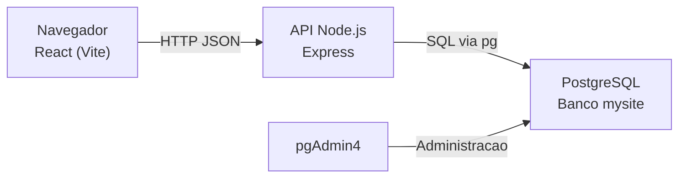

# MySite Fullstack - Arquitetura

Projeto fullstack com frontend em React, backend em Node.js/Express e persistencia em PostgreSQL.
A proposta principal e ter uma base simples, clara e pronta para evoluir.

## 1. Visao geral

- Frontend: React + Vite
- Backend: Node.js + Express
- Banco de dados: PostgreSQL (administrado via pgAdmin4)
- Gerenciamento no repositorio: npm workspaces (monorepo simples)

URL de conexao solicitada para o banco:

`jdbc:postgresql://localhost:5432/mysite`

No backend, essa URL JDBC e convertida automaticamente para formato aceito pelo driver `pg` do Node.

## 2. Arquitetura utilizada

Arquitetura em 3 camadas:

- Camada de apresentacao (UI): `frontend/`
- Camada de API (aplicacao): `backend/server.js`
- Camada de dados (persistencia): `backend/db.js` + PostgreSQL

### Diagrama de componentes



## 3. Estrutura de pastas

```text
mysite/
|- backend/
|  |- .env.example
|  |- db.js
|  |- schema.sql
|  |- server.js
|  |- package.json
|- frontend/
|  |- src/
|  |  |- App.jsx
|  |  |- App.css
|  |  |- main.jsx
|  |- index.html
|  |- vite.config.js
|  |- package.json
|- package.json
|- README.md
```

## 4. Responsabilidade de cada modulo

- `frontend/src/App.jsx`
  - Renderiza tela unica com duas abas: Cadastro e Login
  - Controla estado de formulario
  - Faz chamadas para `POST /api/auth/register` e `POST /api/auth/login`
  - Exibe feedback de sucesso/erro e dados do usuario autenticado

- `backend/server.js`
  - Sobe servidor Express
  - Define rotas HTTP (`/api/health`, `/api/auth/register`, `/api/auth/login`)
  - Valida entrada minima (campos obrigatorios, tamanho de senha)
  - Criptografa senha no cadastro e compara hash no login
  - Inicializa a estrutura de banco ao iniciar o servidor

- `backend/db.js`
  - Carrega variaveis de ambiente
  - Converte JDBC para formato Postgres
  - Cria pool de conexao com `pg`
  - Expoe funcao `query()` para uso no backend
  - Garante criacao da tabela `usuarios` com `initDatabase()`

- `backend/schema.sql`
  - DDL da tabela `usuarios`

## 5. Modelo de dados

Tabela: `usuarios`

- `id` (BIGSERIAL, PK): identificador unico
- `nome` (VARCHAR(120), NOT NULL): nome da pessoa
- `email` (VARCHAR(160), NOT NULL, UNIQUE): login unico
- `senha` (VARCHAR(255), NOT NULL): hash da senha
- `criado_em` (TIMESTAMPTZ, NOT NULL, default NOW()): data de criacao

## 6. Fluxo funcional

### 6.1 Cadastro

1. Usuario preenche `nome`, `email`, `senha` no frontend.
2. Frontend envia `POST /api/auth/register`.
3. Backend valida campos e regra minima de senha.
4. Backend aplica hash com `bcryptjs`.
5. Backend grava usuario no PostgreSQL.
6. API retorna usuario (sem expor hash).

### 6.2 Login

1. Usuario informa `email` e `senha`.
2. Frontend envia `POST /api/auth/login`.
3. Backend busca usuario pelo email.
4. Backend compara senha informada com hash salvo.
5. Em caso de sucesso, API retorna dados do usuario.

### 6.3 Health check

- `GET /api/health` verifica API e conexao com banco.

## 7. Contrato da API

### `POST /api/auth/register`

Body:

```json
{
  "nome": "Ana Silva",
  "email": "ana@email.com",
  "senha": "123456"
}
```

Sucesso (`201`):

```json
{
  "message": "Usuario cadastrado com sucesso.",
  "user": {
    "id": 1,
    "nome": "Ana Silva",
    "email": "ana@email.com",
    "criado_em": "2026-04-03T17:00:00.000Z"
  }
}
```

Erros comuns:

- `400`: campos invalidos ou senha curta
- `409`: email duplicado
- `500`: falha interna

### `POST /api/auth/login`

Body:

```json
{
  "email": "ana@email.com",
  "senha": "123456"
}
```

Sucesso (`200`):

```json
{
  "message": "Login realizado com sucesso.",
  "user": {
    "id": 1,
    "nome": "Ana Silva",
    "email": "ana@email.com",
    "criado_em": "2026-04-03T17:00:00.000Z"
  }
}
```

Erros comuns:

- `400`: campos obrigatorios ausentes
- `401`: credenciais invalidas
- `500`: falha interna

### `GET /api/health`

Sucesso (`200`):

```json
{
  "status": "ok",
  "db": "connected",
  "timestamp": "2026-04-03T17:00:00.000Z"
}
```

## 8. Seguranca aplicada

- Senhas nunca sao salvas em texto puro
- Hash de senha com `bcryptjs` (salt rounds = 10)
- Restricao `UNIQUE` em `email` para evitar duplicidade
- Retorno da API nunca inclui hash da senha

## 9. Configuracao de ambiente

Arquivo de referencia:

- `backend/.env.example`

Variaveis suportadas:

- `DATABASE_JDBC_URL` (ex.: `jdbc:postgresql://localhost:5432/mysite`)
- `DATABASE_URL` (ex.: `postgresql://localhost:5432/mysite`)
- `DB_USER`
- `DB_PASSWORD`
- `DB_SSL` (`true` ou `false`)
- `PORT` (padrao `3001`)

Observacao:

- Se `DB_USER` e `DB_PASSWORD` nao forem definidos, o backend tenta valores padrao para conexao local.

## 10. Execucao local

1. Instalar dependencias na raiz:

```bash
npm install
```

2. Rodar frontend + backend:

```bash
npm run dev
```

3. Acessar:

- Frontend: [http://localhost:5173](http://localhost:5173)
- Health API: [http://localhost:3001/api/health](http://localhost:3001/api/health)

## 11. Scripts disponiveis

- `npm run dev`: sobe frontend e backend em paralelo
- `npm run dev:frontend`: sobe somente frontend
- `npm run dev:backend`: sobe somente backend
- `npm run build`: gera build do frontend
- `npm run start`: sobe backend em modo producao

## 12. Decisoes de arquitetura e trade-offs

- Escolha por monorepo simples com workspaces
  - Vantagem: onboarding rapido e comandos centralizados
  - Trade-off: para times maiores, pode exigir padronizacao extra

- Inicio com backend em arquivo unico (`server.js`)
  - Vantagem: simplicidade para primeiro projeto
  - Trade-off: ao crescer, recomenda-se separar por camadas (`routes`, `controllers`, `services`, `repositories`)

- Sem JWT/sessao no momento
  - Vantagem: foco no fluxo basico de autenticacao
  - Trade-off: nao ha controle de sessao/autorizacao em rotas protegidas

## 13. Proximos passos recomendados

- Adicionar JWT e middleware de autenticacao
- Criar rotas protegidas (perfil, alteracao de senha)
- Separar backend em modulos (`authController`, `authService`, `userRepository`)
- Incluir testes automatizados (unitario + integracao)
- Adicionar migracoes versionadas (ex.: Prisma, Knex ou node-pg-migrate)
