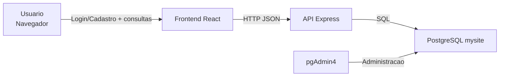

# MySite Fullstack - Plataforma de decisao automotiva

Projeto fullstack com autenticacao de usuarios e tres modulos principais para apoiar a escolha e manutencao de carros:

- Comparador de custo do carro
- Simulador "qual carro combina comigo?"
- Catalogo de pecas e manutencao

## Stack

- Frontend: React + Vite
- Backend: Node.js + Express
- Banco de dados: PostgreSQL (pgAdmin4)
- Monorepo: npm workspaces

Conexao de banco utilizada:

`jdbc:postgresql://localhost:5432/mysite`

O backend converte automaticamente a URL JDBC para formato compativel com o driver `pg`.

## Arquitetura



Camadas:

- Apresentacao: `frontend/src/App.jsx`
- API de negocio: `backend/server.js`
- Dados:
  - Usuarios persistidos no PostgreSQL (`usuarios`)
  - Catalogo de carros/manutencao em memoria (`backend/carCatalog.js`)

## Funcionalidades

### Catalogo ampliado

- O catalogo agora possui 1000 modelos.
- Cada modelo inclui versao (ex.: `Highline`, `Turbo`, `Performance`, `Ultimate`, `Limited`).
- Os modelos estao preparados para comparacao de custo, simulador de perfil e modulo de manutencao.

### 1) Cadastro e login de usuarios

Campos de usuario:

- `id`: identificador unico
- `nome`: nome da pessoa
- `email`: login unico
- `senha`: hash da senha
- `criado_em`: data de criacao

Seguranca:

- Hash de senha com `bcryptjs`
- `email` com restricao `UNIQUE`
- JWT para autenticacao de sessao
- Refresh token com revogacao no banco
- Recuperacao de senha com token temporario

### 2) Comparador de custo do carro

O usuario seleciona modelos e informa quilometragem mensal + preco do combustivel.
A API retorna:

- preco
- consumo
- seguro estimado
- manutencao estimada
- gasto mensal

Formula simplificada:

- `combustivel_mensal = (km_mensal / consumo_km_l) * preco_combustivel`
- `gasto_mensal = combustivel_mensal + seguro_mensal + manutencao_mensal`

### 3) Simulador "qual carro combina comigo?"

Entradas:

- orcamento
- renda mensal
- uso (`urbano` ou `estrada`)
- perfil (`solteiro` ou `familia`)
- prioridade (`economia` ou `desempenho`)

Saida:

- Top 3 sugestoes com score e motivos.

### 4) Site de pecas e manutencao

Para cada modelo:

- revisoes comuns
- pecas mais trocadas
- custo medio mensal
- custo medio de revisoes
- custo medio de pecas
- problemas conhecidos

## Estrutura de pastas

```text
mysite/
|- backend/
|  |- .env.example
|  |- carCatalog.js
|  |- db.js
|  |- schema.sql
|  |- server.js
|  |- package.json
|- frontend/
|  |- src/
|  |  |- App.jsx
|  |  |- App.css
|  |  |- main.jsx
|  |- index.html
|  |- vite.config.js
|  |- package.json
|- package.json
|- README.md
```

## Endpoints da API

### Auth

- `POST /api/auth/register`
- `POST /api/auth/login`
- `POST /api/auth/refresh`
- `POST /api/auth/logout`
- `POST /api/auth/forgot-password`
- `POST /api/auth/reset-password`
- `GET /api/auth/me` (protegido por JWT)

Obs: `register` e `login` retornam `token` (JWT) e `refreshToken`.

### Infra

- `GET /api/health`

### Carros

- `GET /api/cars`
  - Lista catalogo para comparacao/simulador

- `POST /api/cars/compare`
  - Body:

```json
{
  "modelIds": ["chevrolet-onix", "toyota-corolla"],
  "kmMensal": 1400,
  "precoCombustivel": 5.89
}
```

- `POST /api/cars/simulator`
  - Body:

```json
{
  "orcamento": 130000,
  "rendaMensal": 8000,
  "uso": "urbano",
  "perfil": "familia",
  "prioridade": "economia"
}
```

### Perfil (protegido por JWT)

- `PUT /api/profile`
  - Header: `Authorization: Bearer <token>`

### Favoritos (protegido por JWT)

- `GET /api/favorites`
  - Header: `Authorization: Bearer <token>`
- `POST /api/favorites`
  - Header: `Authorization: Bearer <token>`
  - Body:

```json
{
  "carId": "fiat-strada-freedom-2021"
}
```

- `DELETE /api/favorites`
  - Header: `Authorization: Bearer <token>`
  - Body:

```json
{
  "carId": "fiat-strada-freedom-2021"
}
```

### Manutencao

- `GET /api/maintenance`
  - Lista modelos com custo medio mensal

- `GET /api/maintenance/:modelId`
  - Detalha revisoes, pecas e problemas conhecidos

## Configuracao de ambiente

Arquivo exemplo:

- `backend/.env.example`

Variaveis suportadas:

- `DATABASE_JDBC_URL`
- `DATABASE_URL`
- `DB_USER`
- `DB_PASSWORD`
- `DB_SSL`
- `PORT`
- `JWT_SECRET`
- `JWT_EXPIRES_IN`
- `REFRESH_TOKEN_DAYS`
- `PASSWORD_RESET_MINUTES`

## Execucao local

1. Instalar dependencias:

```bash
npm install
```

2. Rodar frontend e backend:

```bash
npm run dev
```

3. Acessar:

- Frontend: [http://localhost:5173](http://localhost:5173)
- Health: [http://localhost:3001/api/health](http://localhost:3001/api/health)

## Scripts

- `npm run dev`
- `npm run dev:frontend`
- `npm run dev:backend`
- `npm run build`
- `npm run start`
- `npm run test`

## Deploy online (Render)

O projeto ja esta preparado para deploy no Render com o arquivo:

- `render.yaml`

Passo a passo:

1. Envie o codigo para o GitHub.
2. No Render, clique em **New +** -> **Blueprint**.
3. Conecte o repositorio `mysite`.
4. O Render vai ler `render.yaml` e criar:
   - 1 servico web (`mysite-web`)
   - 1 banco PostgreSQL (`mysite-db`)
5. Clique em **Apply** para iniciar o deploy.
6. Ao finalizar, abra a URL publica gerada pelo Render.

Observacoes:

- O backend sobe pela porta definida em `PORT` automaticamente (ambiente Render).
- O frontend eh servido pelo proprio backend em producao (`frontend/dist`).
- O health check usa `GET /api/health`.

## Proximos passos sugeridos

- Salvar historico de comparacoes por usuario
- Substituir catalogo em memoria por tabelas no PostgreSQL
- Enviar email real no fluxo de recuperacao de senha
